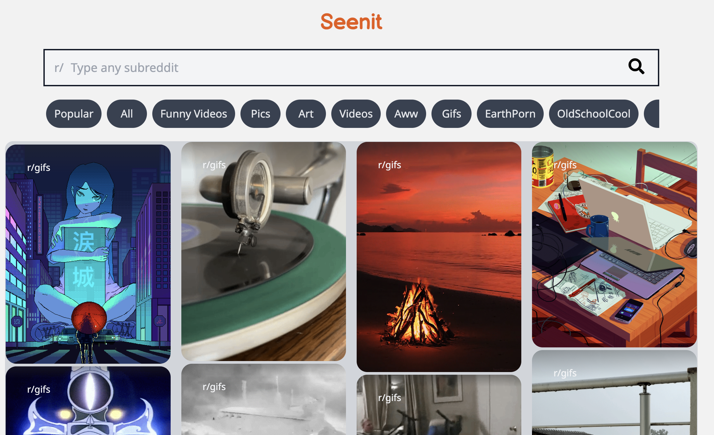
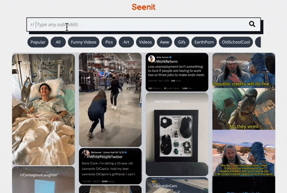

# Seenit - Simple Reddit clone app only with images and videos



This is Seenit, simple reddit clone app only fetching images and videos from any subreddit. It's built with React and Tailwind.

## Table of contents

- [Overview](#overview)
  - [The challenge](#the-challenge)
  - [Screenshot](#screenshot)
  - [Links](#links)
- [My process](#my-process)
  - [Built with](#built-with)
  - [What I learned](#what-i-learned)
- [Future Developments](#future-developments)

## Overview

### The challenge

Users should be able to:

- View the optimal layout for each page depending on their device's screen size
- See popular section on initial page load
- See error message if user types a wrong subreddit
- Change subreddit by clicking a tag below search bar
- click the corresponding links on content
- pause and play videos by clicking

### Screenshot




### Links

- Live Site URL: [Netlify link](https://seenit-reddit-clone.netlify.app)

## My process

### Built with

- Semantic HTML5 markup
- CSS custom properties
- Flexbox
- Grid
- Mobile-first workflow
- [Reddit JSON API](https://github.com/reddit-archive/reddit/wiki/JSON) - Reddit JSON API
- [React](https://reactjs.org/) - JS library
- [Vite](https://nextjs.org/) - React framework
- [Tailwindcss](https://tailwindcss.com) - Tailwindcss

### What I learned

```javascript
// ./src/components/Video.jsx
function Video({ data }) {
  const [isPlaying, setIsPlaying] = useState(false);
  const videoRef = useRef(null);

// Creating corresponding audio files
  const getAudioFileLinks = () => {
    const serialNumber = data.data.media.reddit_video.fallback_url.match(
      /v\.redd\.it\/(.*)\/DASH_/
    )[1];
    const editedLink = `https://v.redd.it/${serialNumber}/DASH_audio.mp4`;
    return editedLink;
  };

  const handleClick = () => {
    if (isPlaying) {
      pause();
      videoRef.current.pause();
    } else {
      play();
      videoRef.current.play();
    }
    setIsPlaying(!isPlaying);
  };

  const soundUrl = getAudioFileLinks();
  const [play, { pause }] = useSound(soundUrl, {
    volume: 0.5,
    loop: true,
    interrupt: true,
  });
  return (
// return video content
  )
  }
```

To control the play/pause buttons of each video content respectively, I used the useRef hook in the Video component. By using useRef, the component stores information without triggering a re-render, which allows users to control the videos without having to reload the entire page. The videoRef variable stores a reference to the video element, enabling it to be controlled with videoRef.current.pause() and videoRef.current.play() methods.

Since videos from the [Reddit JSON API](https://github.com/reddit-archive/reddit/wiki/JSON#data-structures) do not contain audio files, I created a function called getAudioFileLinks to extract the corresponding audio link from the video link. I found this solution thanks to a [Reddit post](https://www.reddit.com/r/redditdev/comments/ihgmv5/getting_audio_from_reddit_video/). To control the sound files, I used the use-sound dependency with pause() and play() methods.

## Future Developments

I noticed that the compatibility with mobile environments is not optimal. In the future, hover effects on images and videos should be replaced on mobile devices.

On mobile, users should be able to:

- Click on a piece of content to play or pause a video
- Have access to the title, votes, comments, and share buttons at all times, without hover effects
- Scroll through content and have it automatically align with the viewport using a React Hook with Intersection Observer (refer to [this article](https://blog.logrocket.com/build-custom-tiktok-autoplay-react-hook-intersection-observer/)
